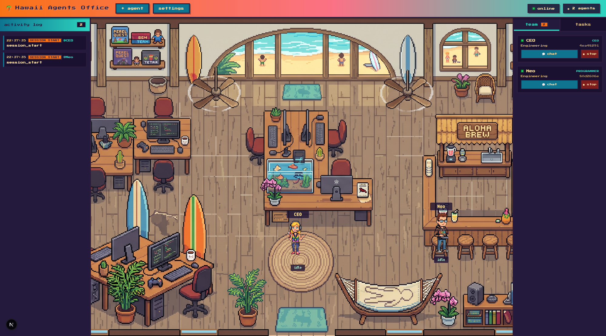

# 🌴 Hawaii Agents Office

A pixel-art game-dev studio visualizer for [Claude Code](https://claude.com/claude-code) sessions.
Every agent you spawn — or any interactive Claude Code session running on your
machine — shows up as an animated character walking around a beach-office,
sitting at a desk, grabbing a coffee, or queuing up for a chat. Task-tool
subagents spawned *inside* a session show up too, as cats wandering near their
owner's desk.



## What it does

- **Live office view** — every Claude Code session on your machine (interactive
  terminal sessions, headless spawned agents, or both) is rendered as a
  character with real-time state (idle / working / waiting on permission /
  arriving / leaving), driven by Claude Code's own hook events.
- **Spawn & chat with agents** — click **+ agent**, give it a name, role, and
  a "brain" (Claude, OpenAI, Gemini, or Ollama), and it appears in the office.
  Open a draggable chat window and talk to it directly; per-message model and
  effort selection is available for Claude agents.
- **File attachments in chat** — drag-and-drop or pick a file to attach to a
  chat message; images are sent as real vision input, text files are inlined.
- **Sub-agent cats** — when a session spawns its own Task-tool sub-agents,
  they appear as cats sitting near their owner, wandering the office while
  busy.
- **Activity log & task board** — a live feed of every hook event
  (session start/stop, tool use, permission requests, subagent lifecycle),
  plus a lightweight task board agents can post to via MCP tools.
- **Settings UI** — configure API keys (OpenAI, Gemini, Ollama, Nano Banana)
  and general app preferences from an in-app settings panel; no restart
  required for most changes.

## Architecture

```
frontend/   Next.js + React + pixi.js — the office canvas, chat windows, activity log, settings UI
backend/    FastAPI — hook event ingestion, session state machine, WebSocket broadcast, chat bridge, provider dispatch
hooks/      A small Python package installed as the `studio-ops-hook` CLI, wired into
            Claude Code's own hooks (SessionStart, PreToolUse, Stop, SubagentStart, …) via ~/.claude/settings.json
```

The frontend and backend talk over REST + WebSocket. The backend never talks
to Claude Code directly for the *observation* side — it only ever receives
events that Claude Code's hooks push to it. For *chat* (sending a message to
a spawned agent), the backend shells out to `claude -p --resume` (or the
relevant provider's API) and streams the reply back over its own
`/ws/chat/{session_id}` channel.

## Prerequisites

- **Node.js 20+** and npm
- **Python 3.12+**
- **[uv](https://docs.astral.sh/uv/)** — used to create the backend venv and
  to install the hooks package as a CLI tool
- **[Claude Code CLI](https://claude.com/claude-code)** installed and logged
  in (`claude` must work from a plain terminal — this is what powers both the
  hook events and the chat-with-agent feature)
- macOS or Linux. On Windows, run everything inside **WSL** — see
  [Windows notes](#windows-notes) below.
- Optional, only if you want agents to use these brains: an OpenAI API key,
  a Gemini API key, and/or a local [Ollama](https://ollama.com) install.

## Installation

### 1. Clone the repo

```bash
git clone https://github.com/resccrew/Hawaii-Agents-Office-.git
cd Hawaii-Agents-Office-
```

### 2. Backend

```bash
cd backend
uv venv
source .venv/bin/activate       # Windows (WSL): same command
uv pip install -e ".[dev]"
```

### 3. Hooks (this is what makes agents appear in the office at all)

The hooks package registers itself as a `studio-ops-hook` CLI tool, then
wires that CLI into Claude Code's global hook config
(`~/.claude/settings.json`). Without this step the app will start, but the
office will stay empty — nothing tells it a Claude Code session exists.

```bash
cd ../hooks
uv tool install --editable .
uv tool update-shell   # only needed once, if `studio-ops-hook` isn't found on PATH afterwards
python manage_hooks.py install --hook-cmd studio-ops-hook
```

This is safe to run alongside other hook-based tools — it only *appends* a
`studio-ops-hook <event>` entry per hook type, backing up your existing
`settings.json` to `settings.json.bak` the first time it touches it. Run
`python manage_hooks.py uninstall --hook-cmd studio-ops-hook` to remove it
later.

### 4. Frontend

```bash
cd ../frontend
npm install
```

## Running it

Two processes, in two terminals:

```bash
# Terminal 1 — backend (fixed port 8010; the frontend and its CORS config both assume this)
cd backend
source .venv/bin/activate
uvicorn app.main:app --reload --port 8010

# Terminal 2 — frontend (fixed port 3010, set in package.json's dev script)
cd frontend
npm run dev
```

Open **http://localhost:3010**. Any Claude Code session you start anywhere on
the machine (as long as the hooks are installed) will appear in the office
within a couple of seconds.

> **Ports are not arbitrary.** The backend's CORS policy only allows
> `http://localhost:3010`, and the frontend's default backend URL (see
> Settings → General) is hardcoded to `http://localhost:8010`. If you already
> have something else running on 3010/8010, either free the port or change
> both sides together (`frontend/package.json`'s `dev` script + the CORS
> `allow_origins` list in `backend/app/main.py` + the default in
> `frontend/src/stores/uiSettingsStore.ts`).

## Configuring API keys

Open **settings** in the toolbar and fill in whichever providers you want to
use — keys are saved to `~/studio-ops/state/settings.json` (outside the repo,
never committed). Equivalently, set environment variables before starting the
backend (an env var is used as a fallback whenever no value is saved in
Settings):

```
STUDIO_OPS_OPENAI_API_KEY
STUDIO_OPS_OPENAI_MODEL
STUDIO_OPS_GEMINI_API_KEY
STUDIO_OPS_GEMINI_MODEL
STUDIO_OPS_OLLAMA_BASE_URL
STUDIO_OPS_OLLAMA_MODEL
STUDIO_OPS_NANOBANANA_API_KEY
```

Claude agents need no key here — they run through your existing `claude` CLI
login.

## Running the tests

```bash
cd backend
source .venv/bin/activate
pytest

cd ../frontend
npm run typecheck
```

> `test_chat_bridge.py` has two tests that share a live Claude CLI session
> fixture and are documented as order-sensitive when run back-to-back in one
> pytest session — run them individually (`pytest -k <name>`) if you see a
> spurious failure there.

## Troubleshooting

- **"The office is empty / nothing shows up"** — the hooks probably aren't
  installed, or `~/.claude/settings.json` points `studio-ops-hook` at a
  binary that isn't on PATH. Re-run step 3, or check
  `which studio-ops-hook`.
- **Chat / file attachments silently do nothing, or "Failed to fetch"** —
  make sure you're on **http://localhost:3010**, not some other port a
  different local project happens to be using. If you've worked on other
  Next.js apps on this machine, it's easy to land on the wrong one at the
  default port 3000.
- **Chat calls hang for ~2 minutes then error out** — `claude -p` has no TTY
  to answer a permission prompt with; this only happens for hook-observed
  interactive sessions (spawned agents run with `bypassPermissions` in their
  own isolated workspace and don't hit this).
- **A cat/dev sprite never disappears from the office** — known open issue:
  `SubagentStop` occasionally fails to match the `agent_id` from
  `SubagentStart`, leaving that sub-agent's state stuck. Restarting the
  backend clears it.

## Windows notes

The frontend and backend have no macOS/Linux-only code (no `osascript`,
no POSIX-only syscalls, all paths go through `pathlib.Path.home()`). The one
real risk on **native** Windows Python is that the backend invokes the
`claude` CLI via `asyncio.create_subprocess_exec("claude", ...)` — Windows'
`CreateProcess` doesn't resolve `PATHEXT` the way a shell does, so an
npm-installed `claude.cmd` shim may not be found even though `claude` works
fine from a normal terminal. Running everything inside **WSL** sidesteps this
entirely (it behaves exactly like Linux); running natively on Windows may
need a small fix to `backend/app/services/claude_cli_service.py` to resolve
the full shim path explicitly.

## License

No license file yet — treat as all-rights-reserved until one is added.
